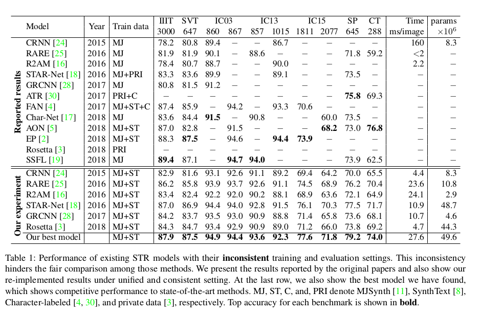

# Transformer-based Scene Text Recognition (Transformer-STR)

- PyTorch implementation of my new method for Scene Text Recognition (STR) based on [Transformer](https://arxiv.org/abs/1706.03762).

I adapted the four-stage STR framework devised by [deep-text-recognition-benchmark](https://arxiv.org/abs/1904.01906), and replaced the `Pred.` stage with **Transformer**.

Equipped with Transformer, this method outperforms the best model of the aforementioned deep-text-recognition-benchmark by **7.6%** on CUTE80.

### Download pretrained weights from [here](https://drive.google.com/file/d/1o7aEt_Rmz5ZDIZqc2Z74lo01Tjq87uO1/view?usp=sharing)
This pre-trained weights trained on Synthetic dataset for about 700K iters.

Git clone this repo and download the weights file,  move it to `checkpoints` directory.

### Download lmdb dataset for traininig and evaluation from [here](https://drive.google.com/drive/folders/192UfE9agQUMNq6AgU3_E05_FcPZK4hyt)(provided by [deep-text-recognition-benchmark](https://arxiv.org/abs/1904.01906))
data_lmdb_release.zip contains below. <br>
training datasets : [MJSynth (MJ)](http://www.robots.ox.ac.uk/~vgg/data/text/)[1] and [SynthText (ST)](http://www.robots.ox.ac.uk/~vgg/data/scenetext/)[2] \
validation datasets : the union of the training sets [IC13](http://rrc.cvc.uab.es/?ch=2)[3], [IC15](http://rrc.cvc.uab.es/?ch=4)[4], [IIIT](http://cvit.iiit.ac.in/projects/SceneTextUnderstanding/IIIT5K.html)[5], and [SVT](http://www.iapr-tc11.org/mediawiki/index.php/The_Street_View_Text_Dataset)[6].\
evaluation datasets : benchmark evaluation datasets, consist of [IIIT](http://cvit.iiit.ac.in/projects/SceneTextUnderstanding/IIIT5K.html)[5], [SVT](http://www.iapr-tc11.org/mediawiki/index.php/The_Street_View_Text_Dataset)[6], [IC03](http://www.iapr-tc11.org/mediawiki/index.php/ICDAR_2003_Robust_Reading_Competitions)[7], [IC13](http://rrc.cvc.uab.es/?ch=2)[3], [IC15](http://rrc.cvc.uab.es/?ch=4)[4], [SVTP](http://openaccess.thecvf.com/content_iccv_2013/papers/Phan_Recognizing_Text_with_2013_ICCV_paper.pdf)[8], and [CUTE](http://cs-chan.com/downloads_CUTE80_dataset.html)[9].


### Training
Please configure your `data_dir` in `config.py` file, then run:

```python
python tools/train.py
```

### Evaluation on CUTE80
The Transformer-base STR achieves **0.815972** accuracy on CUTE80, outperforming the best model of *deep-text-recognition-benchmark*, which is 0.74



If you want to reproduce the evaluation result, please run:

```python
python evaluation.py
```

Make sure your `cute80_dir` and `saved_model` path is correct. you'll get the result **0.815972**


### Contact
Feel free to contact me (gao.gzhou@gmail.com).

### License
This project is released under the [Apache 2.0 license.](https://www.apache.org/licenses/LICENSE-2.0)

### References
[deep-text-recognition-benchmark](https://arxiv.org/abs/1904.01906)
